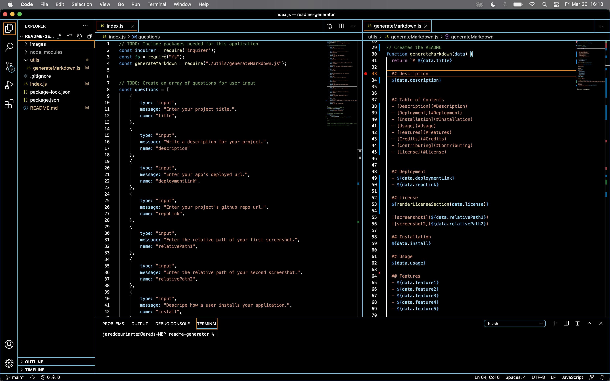

# README Generator

  ## Description
  Among the tasks asked of a developer, somehow out of all the text we write a simple README is the biggest bother––hunting down a markdown cheatsheet, copying and pasting from an old README, riffling through windows and screens to copy urls and relative paths, flipping back and forth between the document and 'Open Preview'. This application automates the brunt of creating a README through the simple expedient of command line interfacing.

  ## Table of Contents
  - [Description](#Description)
  - [Deployment](#Deployment)
  - [Installation](#Installation)
  - [Usage](#Usage)
  - [Features](#Features)
  - [Credits](#Credits)
  - [Contributing](#Contributing)
  - [License](#License)
  

  ## Deployment
  - [GitHub Repo](https://github.com/jareddeuriarte/readme-generator)
  
  ## License 
  This project is licensed under MIT.

  
  
  
  ## Installation
  - Make sure Node.js is installed on your local device.
  - Fork and download this repo.
   
  ## Usage
  - Open your command line interface. 
  - cd into the directory where this repo is saved.
  - Enter into the command line "node index.js"
  - Voila! Copy and paste the generated README into your project's repo! 

  ## Features
  - Auto-formatting
  - Inquirer based input 
 

  ## Credits  
  My tutor Namita. 
  - [A list of licenses with their links and badges. So helpful!](https://gist.github.com/lukas-h/2a5d00690736b4c3a7ba#isc)

  ## Contributing
  Forks are welcome!

  ## Badges
  
  

  
  ## Questions
  Reach me at:
  - [GitHub](https://github.com/jareddeuriarte)
  - deuriartejared@gmail.com

